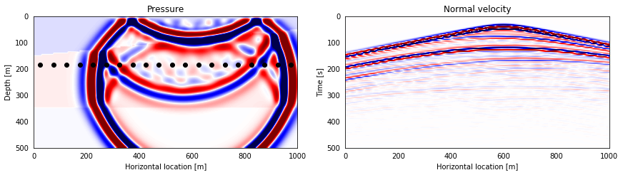

.. Serendipyty: A Python toolbox for teaching Geophysics documentation master file, created by
   sphinx-quickstart on Fri Jan 19 09:30:05 2018.
   You can adapt this file completely to your liking, but it should at least
   contain the root `toctree` directive.

Welcome to Serendipyty
======================
A Python toolbox for teaching Geophysics
========================================

.. raw:: html

    

    

    <h2 class="text-center">For teaching</h2>

Integrate Serendipyty with Jupyter notebooks to create beautiful documents for students.

.. raw:: html

    

    

    <h2 class="text-center">For research</h2>

Use Serendipyty to implement and test novel research ideas.

.. raw:: html

    

.. raw:: html

	
 <!-- Row -->

Content
-------
.. toctree::
    :maxdepth: 2

    examples
    development

Indices and tables
------------------

* :ref:`genindex`
* :ref:`modindex`
* :ref:`search`

